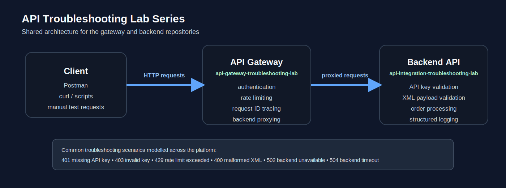

# API Gateway Troubleshooting Lab

A lightweight API gateway built with FastAPI that simulates common API
platform failures such as authentication errors, rate limiting, backend
outages, and request tracing.

This repository is part of the **API Troubleshooting Lab Series**, a
multi-service environment designed to demonstrate real-world integration
debugging and platform support scenarios.

Companion repository:

API Integration Troubleshooting Lab  
https://github.com/GregoryCarberry/api-integration-troubleshooting-lab

---

# Lab Series Architecture

The gateway sits between clients and the backend API service. It
implements platform-level behaviours commonly found in production API
gateways.

---

# Quick Start

1. Start the backend API
2. Start the gateway
3. Send requests via Postman or curl
4. Observe platform-level failures

---

# What This Project Demonstrates

This lab simulates **realistic API platform troubleshooting scenarios**.

Skills demonstrated:

- API authentication debugging
- rate limiting behaviour analysis
- request tracing with correlation IDs
- isolating gateway vs backend failures
- diagnosing upstream service failures

---

# Failure Scenarios

| Scenario | Layer | Response |
|--------|--------|--------|
| Missing API key | Gateway | 401 |
| Invalid API key | Gateway | 403 |
| Rate limit exceeded | Gateway | 429 |
| Backend unavailable | Gateway | 502 |
| Backend timeout | Gateway | 504 |

---

# Troubleshooting Workflow Example

Client request fails  
↓  
Gateway returns **502 Bad Gateway**  
↓  
Inspect gateway logs for **X-Request-ID**  
↓  
Trace request in backend logs  
↓  
Identify root cause (payload error / backend failure)  
↓  
Correct request and retry

---

# Observability

Each request receives a unique **X-Request-ID**.

This ID:

- appears in gateway logs
- is forwarded to the backend
- allows cross-service log tracing

---

# Features

## Authentication

Requests must include:

    X-API-Key: lab-demo-key

## Rate Limiting

Clients are limited to a fixed number of requests per time window.

Exceeded limits return:

    429 Too Many Requests

## Request Tracing

The gateway generates a request ID if one is not provided.

## Backend Proxying

Gateway endpoints forward requests to the backend service.

Example:

    GET /gateway/health → GET /health (backend)

---

# Repository Structure

api-gateway-troubleshooting-lab/

├── app/  
│   ├── main.py  
│   ├── auth.py  
│   ├── rate_limit.py  
│   ├── utils.py  
│   ├── proxy.py  
│   ├── config.py  
│   └── logging_config.py  

├── docs/  
│   └── api-troubleshooting-lab-shared-architecture.svg  

├── requirements.txt  
└── README.md  

---

# Running the Gateway

Create a virtual environment:

    python -m venv .venv
    source .venv/bin/activate

Install dependencies:

    pip install -r requirements.txt

Run the gateway:

    uvicorn app.main:app --reload

Gateway endpoint:

    http://localhost:8000

---

# Example Requests

Gateway health:

    curl http://localhost:8000/health

Backend health via gateway:

    curl -H "X-API-Key: lab-demo-key" http://localhost:8000/gateway/health

Rate limit test:

    curl -H "X-API-Key: lab-demo-key" http://localhost:8000/gateway/health

---

# Lab Exercises

- Trigger authentication errors
- Trigger rate limiting
- Observe gateway error responses
- Trace request IDs across services

---

# System Design Notes

This gateway models behaviours commonly implemented by:

- Kong
- AWS API Gateway
- NGINX-based gateways

It isolates platform-level functionality from application logic,
allowing failures to be diagnosed more easily.

---

# Future Improvements

- distributed tracing integration
- metrics collection
- containerised deployment
